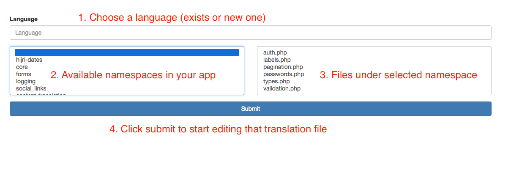
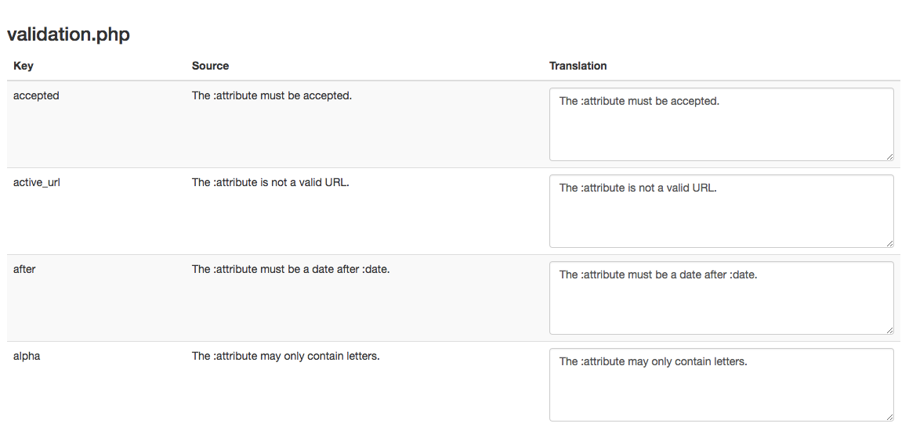

# Translation manager for Laravel 5.x

A WebUI to manage translation files for Laravel.

- [Features](#features)
- [Installation](#installation)
- [Screen shots for WebUI](#images)
- [License](#license)

### Features

* Update existing translation file.
* Create new language for a translation file.
* Manage languages files of third party packages.

## Installation

1- Add the package to your project.

Add it to your `composer.json` file

```
"geniusts/laravel-translation-manager": "~0.1.0"
```

or install it via `composer`.

```
composer require geniusts/laravel-translation-manager
```

2- Add the package service provider to `config/app.php` file, under `providers` section.

```php
GeniusTS\TranslationManager\TranslationManagerServiceProvider::class,
```

The service provider will added automatically if you are using Laravel 5.5

3- If you want to change prefix or middleware applied on routes, publish configuration file.

```
artisan vendor:publish --provider='\GeniusTS\TranslationManager\TranslationManagerServiceProvider' --tag=config
``` 

4- If you want to change views layouts, publish views files.

```
artisan vendor:publish --provider='\GeniusTS\TranslationManager\TranslationManagerServiceProvider' --tag=views
``` 

## images




## License

This package is free software distributed under the terms of the MIT license.
